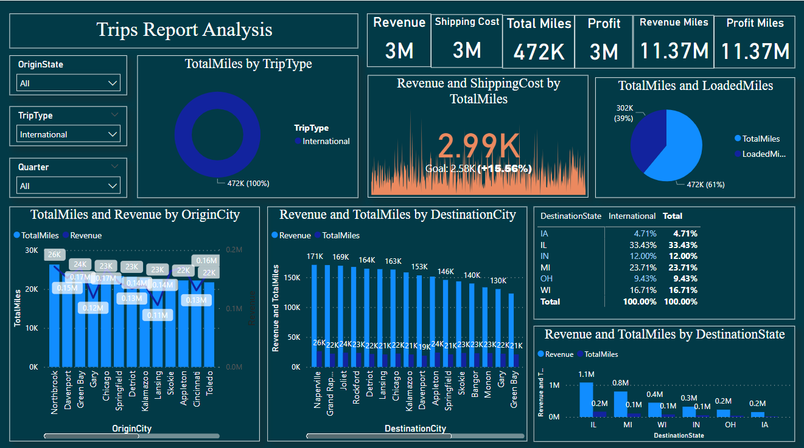

# 🚗 Trips Report Analysis (Excel + Power BI)

This project showcases a comprehensive data analysis workflow using Microsoft Excel and Power BI. It demonstrates raw data transformation, insights generation, and interactive dashboards built around trip-related information.

---

## 📁 Files Included

| File | Description |
|------|-------------|
| `Trips.xlsx` | Contains the raw data used for the analysis |
| `Trips Report Analysis.pbix` | Power BI report visualizing trends, summaries, and KPIs |

---

## 🔍 Key Features

### ✅ Excel (Trips.xlsx)
- Structured and cleaned tabular data
- Fields include: Trip Date, Start Time, End Time, Distance, Duration, etc.
- Prepped for Power BI import

### ✅ Power BI Report (Trips Report Analysis.pbix)
- **Interactive Dashboard** with:
  - Monthly trip trends
  - Total distance and duration metrics
  - Day-wise and time-wise breakdowns
  - Visuals for patterns in trip behavior

---

## 📊 Tools Used

- Microsoft Excel (data cleaning)
- Power BI (data modeling and visualization)
- DAX (Calculated fields and KPIs)

---

## 🧠 Insights & Learnings

- Identified peak travel times and dates
- Recognized efficiency trends over time
- Learned Power BI best practices (DAX, filters, relationships)

---

## 💡 How to Use

1. Open `Trips.xlsx` to review the raw data.
2. Open `Trips Report Analysis.pbix` in Power BI Desktop.
3. Refresh the data if prompted (Excel file must be in the same folder).

---

## 📸 Report Preview

## 📫 Contact
Rajababu Ray

